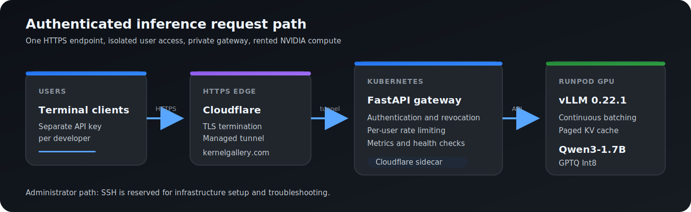

# Inference Systems Lab

A production-oriented AI inference platform built incrementally from a local
Apple Silicon prototype to a shared, authenticated GPU service.

The repository focuses on inference engineering rather than model training:
serving, streaming, concurrency, quantization, observability, deployment,
failure recovery, security boundaries, and measured capacity.

## Outcome

The final system serves `Qwen3-1.7B-GPTQ-Int8` with vLLM on a rented RunPod
NVIDIA RTX PRO 4000 GPU. Users connect through one HTTPS endpoint with
individual API keys. The gateway enforces authentication, revocation,
per-user rate limits, metrics, and upstream health checks without exposing SSH
or distributing the raw vLLM endpoint to users.

Verified results:

- Five independently authenticated users streamed responses concurrently.
- GPTQ Int8 delivered up to 1,168.70 output tokens/s at concurrency 8.
- GPTQ improved throughput by 32.8% to 42.9% over FP16.
- Capacity testing reached concurrency 128 without request failures or OOM.
- Kubernetes replacement, failed rollout, and rollback behavior were tested.
- A controlled CUDA OOM remained isolated and inference continued afterward.
- RunPod restored the inference runtime automatically after a Pod reset.

## Architecture



Request path:

```text
Terminal client
  -> Cloudflare HTTPS endpoint
  -> Cloudflare Tunnel sidecar
  -> private Kubernetes gateway
  -> RunPod vLLM
  -> Qwen3-1.7B GPTQ Int8
```

Administrative SSH is used only for infrastructure setup and troubleshooting.
End users receive a gateway API key, not GPU host access.

## Measured Performance

### FP16 vs GPTQ Int8

Each run sent eight identical streaming chat requests with 128 generated
tokens per request on the rented RTX PRO 4000.

| Concurrency | FP16 tok/s | GPTQ tok/s | GPTQ gain | FP16 p95 | GPTQ p95 |
| ---: | ---: | ---: | ---: | ---: | ---: |
| 1 | 114.96 | 152.61 | 32.8% | 1.127 s | 0.849 s |
| 2 | 217.48 | 310.82 | 42.9% | 1.192 s | 0.850 s |
| 4 | 429.06 | 599.40 | 39.7% | 1.195 s | 0.876 s |
| 8 | 849.13 | 1,168.70 | 37.6% | 1.203 s | 0.871 s |

| Memory metric | FP16 | GPTQ Int8 |
| --- | ---: | ---: |
| Model weights | 3.22 GiB | 1.92 GiB |
| Available KV cache | 17.16 GiB | 18.18 GiB |
| KV cache capacity | 160,624 tokens | 170,160 tokens |
| Full-context concurrency estimate | 3.92x | 4.15x |

GPTQ Int8 became the serving format because it improved throughput and latency,
reduced model-weight memory by 40.4%, and left more capacity for KV cache.

### Capacity

| Concurrency | Success | Output tok/s | Mean TTFT | p95 latency |
| ---: | ---: | ---: | ---: | ---: |
| 16 | 16/16 | 2,229 | 270 ms | 0.914 s |
| 32 | 32/32 | 4,039 | 256 ms | 0.984 s |
| 64 | 64/64 | 6,405 | 303 ms | 1.235 s |
| 128 | 128/128 | 8,460 | 422 ms | 1.920 s |

Concurrency 32 was selected as the balanced point for interactive traffic.
Higher concurrency increased aggregate throughput but raised token latency.

### Shared HTTPS Access

Five users with five separate API keys were tested concurrently through the
public HTTPS endpoint:

| Result | Measurement |
| --- | ---: |
| Successful users | 5/5 |
| Total wall time | 3.73 s |
| Fastest TTFT | 1.83 s |
| Slowest TTFT | 3.71 s |
| Revoked user | HTTP 401 |
| Rate-limited user | HTTP 429 |
| Unaffected second user | HTTP 200 |

Detailed evidence is stored in the project benchmark and report files.

## Engineering Progression

| Version | Project | Engineering result |
| --- | --- | --- |
| v0.1 | [Service Foundations](projects/01-service-foundations) | Typed FastAPI service, configuration, lifecycle, health checks, Docker, tests, and CI |
| v0.2 | [Local Inference](projects/02-local-inference) | Qwen3-1.7B on Apple Silicon with MLX and llama.cpp, pinned artifacts, benchmarks, and OpenAI-compatible API |
| v0.3 | [Production Serving](projects/03-production-serving) | SSE streaming, bounded concurrency, FIFO queueing, backpressure, timeouts, rate limits, Prometheus, Grafana, and failure tests |
| v0.3.1 | Context Safety | Token-aware context validation and OpenAI-compatible overflow errors |
| v0.3.2 | Conversation Memory | Pressure-based history compaction with preservation of explicit remembered facts |
| v0.4 | [NVIDIA Inference](projects/04-nvidia-inference) | Rented NVIDIA GPU, vLLM, continuous batching, KV cache analysis, FP16/GPTQ comparison, capacity and OOM tests |
| v0.5 | [Reliable Deployment](projects/05-reliable-deployment) | Private multi-platform images, Kubernetes probes and resources, immutable rollout, rollback, Secret injection, and CI validation |
| v0.6 | [Internal Inference Access](projects/06-internal-inference-access) | HTTPS access, per-user keys, revocation, rate limits, user metrics, concurrent clients, and automatic RunPod recovery |

Multi-GPU inference is intentionally deferred. The current project already
demonstrates the complete single-GPU serving lifecycle, and a meaningful
multi-GPU phase requires a larger model and measured 2+ GPU comparison.

See [Roadmap.md](Roadmap.md) for the original version goals and completion
criteria.

## Key Technical Decisions

### Small model, real infrastructure

The model is an infrastructure workload, not the product being evaluated.
Qwen3-1.7B is small enough for fast iteration but still exercises tokenization,
streaming, context limits, KV cache, quantization, GPU memory, batching, and
concurrent serving.

### OpenAI-compatible API

The same chat contract is used across local MLX, llama.cpp, and remote vLLM
backends. Clients can change infrastructure without changing their request
shape.

### Bounded local inference

MLX executes one active generation while excess requests enter a bounded FIFO
queue. Saturation returns HTTP 429 instead of allowing unbounded memory growth.
This made queue wait, backpressure, and tail latency visible before moving to
GPU continuous batching.

### vLLM for NVIDIA serving

vLLM provides continuous batching, paged KV-cache management, streaming, and
an OpenAI-compatible server. The benchmark showed near-linear throughput
scaling through concurrency 8 and useful capacity through concurrency 128.

### Official GPTQ over community AWQ

The official Qwen GPTQ checkpoint used Apache-2.0 and worked on the tested
Blackwell environment. The available AWQ checkpoint was community-maintained,
used GPL-3.0, and hit a Blackwell FlashInfer compatibility problem. It was
excluded rather than presenting an unreliable comparison.

### Private gateway instead of user SSH

SSH is an administrator mechanism, not a multi-user application interface.
Separate API keys allow one user to be revoked or rate-limited without
affecting every other user.

### Kubernetes for service lifecycle

Kubernetes supplies stable service discovery, health-based readiness,
automatic Pod replacement, resource boundaries, Secret injection, controlled
rollouts, and rollback. The local cluster validates these operational controls
without consuming rented GPU time.

### Cloudflare Tunnel for HTTPS ingress

The tunnel creates an outbound connection from the Kubernetes Pod, so the
local gateway does not require an inbound router port. Cloudflare terminates
HTTPS, while application authorization remains the gateway's responsibility.

### Immutable artifacts and explicit deployment

GitHub Actions publishes private multi-platform images with commit-based tags.
Deployment remains a reviewed manifest change instead of automatically
replacing the running service after every push.

## Reliability And Failure Evidence

- Queue overflow returns `429 server_busy`.
- Per-user token bucket exhaustion returns `429` without blocking other users.
- Backend failure returns `503 backend_unavailable`.
- First-result timeout returns `504 request_timeout`.
- Oversized context returns `400 context_length_exceeded`.
- Client disconnect releases the active admission slot.
- A deleted Kubernetes Pod is recreated automatically.
- A nonexistent private image produces `ErrImagePull` while the existing ready
  Pod remains available.
- `kubectl rollout undo` restores the last working immutable image.
- A separate CUDA OOM process fails without terminating vLLM.
- A RunPod reset restores the pinned runtime and model through the persistent
  startup script.

## Security Model

- One API key per user
- Runtime revocation without rotating every user
- Per-user rate limits and metrics
- Gateway keys are never forwarded to vLLM
- RunPod SSH remains administrator-only
- Kubernetes Secrets are created outside Git
- CI rejects committed Kubernetes Secret resources
- Private images are pulled from GHCR with cluster credentials
- The Kubernetes gateway is a private ClusterIP Service
- Cloudflare Tunnel provides HTTPS transport but does not replace API
  authentication

## Technology

| Area | Technologies |
| --- | --- |
| API and runtime | Python 3.13, FastAPI, Pydantic, Uvicorn, httpx, uv |
| Local inference | MLX, llama.cpp, Apple Silicon, Metal |
| NVIDIA inference | CUDA, PyTorch, vLLM, GPTQ, RunPod |
| Protocols | OpenAI-compatible REST, Server-Sent Events |
| Observability | Prometheus, Grafana, structured metrics |
| Containers | Docker, Docker Compose, GHCR, multi-platform OCI images |
| Orchestration | Kubernetes, kind, readiness and liveness probes |
| Access | Cloudflare Tunnel, HTTPS, per-user API keys |
| Quality | pytest, Ruff, mypy, coverage, GitHub Actions |

## Demo

The live service requires an assigned user key:

```bash
cd projects/06-internal-inference-access
export INFERENCE_API_KEY="assigned-user-key"
uv run internal-inference-chat
```

Open three or more terminals with different user keys and submit prompts at
the same time. Each client receives a streamed response through:

```text
https://inference.kernelgallery.com
```

Health checks:

```bash
curl https://inference.kernelgallery.com/health/live
curl https://inference.kernelgallery.com/health/ready
```

Recommended two-minute demonstration:

1. Show the architecture diagram and explain the user-to-GPU request path.
2. Start three terminal clients with separate API keys.
3. Submit prompts concurrently and show streamed responses.
4. Show the five-user benchmark and FP16/GPTQ comparison.
5. Explain that SSH is administrator-only and user access is independently
   revocable.
6. Show Kubernetes health, rollout, and restart evidence in the reports.

## CV Summary

Suggested project title:

**Production AI Inference Platform**

Suggested CV bullets:

- Built an OpenAI-compatible inference platform from local Apple Silicon
  development to authenticated NVIDIA GPU serving with FastAPI, vLLM, Docker,
  Kubernetes, Cloudflare Tunnel, and RunPod.
- Benchmarked FP16 and GPTQ Int8 on an RTX PRO 4000, improving output
  throughput by 32.8% to 42.9% and validating capacity up to 128 concurrent
  requests.
- Implemented streaming, bounded admission control, backpressure, timeouts,
  context safety, conversation compaction, Prometheus metrics, Grafana
  dashboards, and failure isolation.
- Delivered per-user API keys, revocation, rate limiting, private container
  images, immutable deployment, rollback, health-based recovery, and automatic
  GPU runtime restoration.

## Interview Discussion

### Why not use a larger model?

The project evaluates inference infrastructure. A larger model would increase
cost and startup time without changing the core serving, deployment, security,
or observability problems. Model size should increase when memory pressure or
multi-GPU scaling becomes the experiment.

### Why did local concurrency use a queue?

The MLX backend safely supported one active inference operation. A bounded
queue preserved predictable resource use and returned HTTP 429 when capacity
was exhausted. This is different from vLLM, which continuously batches
multiple requests on the GPU.

### What did quantization change?

GPTQ reduced model-weight memory from 3.22 GiB to 1.92 GiB. vLLM used much of
the freed memory for a larger KV cache, while throughput increased and p95
latency decreased at every tested concurrency.

### Why is concurrency 32 preferred if 128 worked?

Concurrency 128 maximized aggregate throughput, but p95 latency reached
1.92 seconds and token latency increased. Concurrency 32 retained sub-second
p95 latency and was a better interactive operating point.

### Why use Kubernetes locally if the GPU runs on RunPod?

The cluster validates deployment behavior independently from expensive GPU
compute. It manages the gateway lifecycle, health probes, Secrets, image
rollouts, and tunnel connector. RunPod remains the specialized compute layer.

### What happens when the GPU service is unavailable?

Gateway readiness fails and inference requests receive a controlled upstream
error. The gateway process remains live, which distinguishes application
health from dependency readiness.

### What would be required for multiple gateway replicas?

Revocation and rate-limit state must move from process memory to shared
storage such as Redis. Credential lifecycle should move to an identity
provider or managed secret system.

### Why stop before multi-GPU?

A credible multi-GPU project requires a model that cannot be served
efficiently on one GPU, at least two comparable GPUs, and measurements of
tensor parallel scaling and NCCL overhead. Adding flags without that evidence
would not improve the engineering story.

## Operational Limits

- One rented GPU remains the inference capacity boundary.
- Revocation and rate-limit state are process-local.
- RunPod restart time includes runtime installation and model loading.
- The local Kubernetes cluster has one node and does not prove node-level high
  availability.
- Static API keys are appropriate for this lab but not a complete enterprise
  identity lifecycle.
- Cloudflare Tunnel availability and the rented GPU provider remain external
  dependencies.
- The RunPod HTTP proxy is provider-managed and is not the authorization
  boundary. A stricter production design would place vLLM on a private network
  reachable only by the gateway.

## Evidence

- [Local inference implementation](projects/02-local-inference)
- [Production serving report](projects/03-production-serving/REPORT.md)
- [NVIDIA benchmark report](projects/04-nvidia-inference/REPORT.md)
- [Kubernetes deployment report](projects/05-reliable-deployment/REPORT.md)
- [Internal access report](projects/06-internal-inference-access/REPORT.md)
- [Five-user streaming evidence](projects/06-internal-inference-access/benchmarks/five-user-streaming.json)
- [Access-control evidence](projects/06-internal-inference-access/benchmarks/access-control.json)
